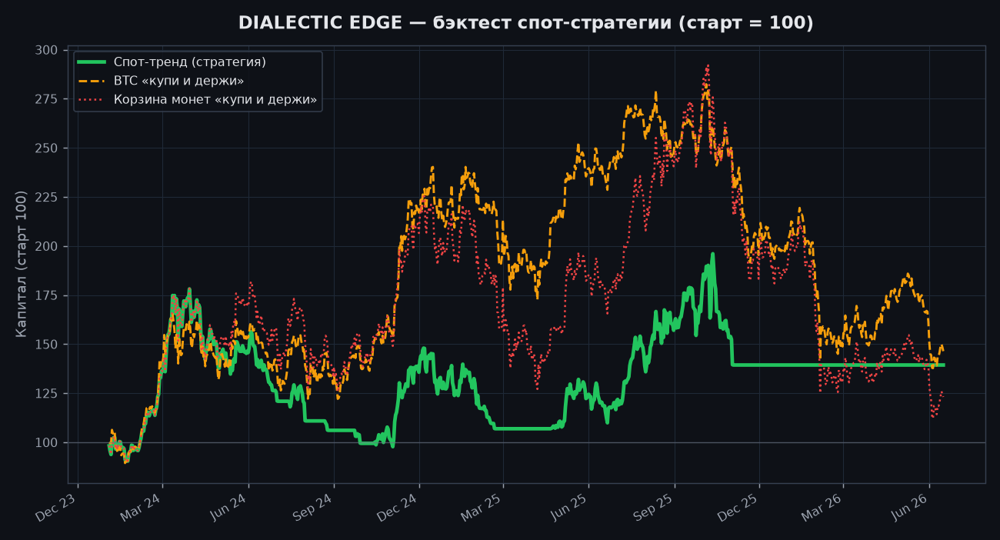

# 📊 Бэктест спот-стратегии Dialectic Edge
> Сгенерировано: 2026-06-18 · период 2024-01-04 → 2026-06-18 (~2.5 г., 895 торговых дней)

**Стратегия «Дисциплинированный спот-тренд»** — только спот, только лонг, без плеча и шортов:
- Юниверс: BTC, ETH, SOL, BNB.
- Торгуем только когда BTC выше SMA200 (рынок в аптренде), иначе весь капитал в стейбле.
- Держим равным весом монеты с ценой выше SMA100. Ежедневная ребалансировка, комиссия 0.1%.

## Итоги (старт капитала = 100)

| Метрика | 🟢 Спот-тренд | BTC «держать» | Корзина «держать» |
|---|---|---|---|
| Доходность | **+39.4%** | +46.4% | +23.1% |
| Годовая (CAGR) | **+14.5%** | +16.8% | +8.8% |
| Макс. просадка | **-45.1%** | -51.2% | -61.6% |
| Sharpe (год.) | **0.54** | — | — |
| Дней «в плюсе» | +28.6% | — | — |
| Время в рынке | +58.0% | 100% | 100% |

## Что это значит

- **Обгоняет «просто держать корзину монет»** и по доходности (+39.4% против +23.1%), и по риску (просадка -45.1% против -61.6%).
- **Просадка мягче, чем у BTC** (-45.1% против -51.2%) — потому что в медвежьем рынке стратегия уходит в стейбл, а не сидит в падении.
- **Только +58.0% времени в рынке** — остальное капитал в стейбле. Это и есть «защита без шортов»: меньше риска за сопоставимую доходность.
- В сильном бычьем рынке простой холд BTC по чистой доходности может опережать — это нормально: стратегия покупает спокойствие и меньшие просадки, а не максимум плеча.

> ⚠️ Это историческая симуляция на дневных данных Yahoo, а не гарантия будущего. Не инвестиционный совет. Прошлые результаты не предсказывают будущие.

_Воспроизвести: `python research/spot_trend_backtest.py`_
