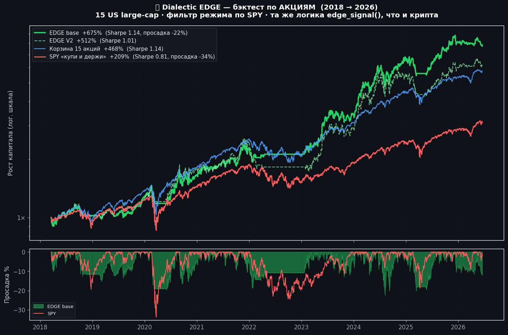

# 📊 Dialectic EDGE — бектест по АКЦИЯМ

> Та же сигнальная функция `halal_edge.edge_signal()`, что и крипто-edge.
> Единственное отличие — универс (15 US large-cap) и актив краш-фильтра
> режима: вместо `BTC < SMA200` используется `SPY < SMA200`.
> Период: **2018-03-20 → 2026-06-17** (2072 торговых дня). Данные — daily
> adjusted close (yfinance). Комиссия 0.1% на оборот. Sharpe ann. √252.

## 🎯 Методология (1:1 с крипто-edge)
- **Dual momentum**: акция входит только если цена > SMA(trend) И средний импульс > 0; из прошедших берём ТОП-K сильнейших.
- **Веса**: equal / inverse-vol / momentum-power (как в крипте).
- **Краш-фильтр режима**: SPY < SMA200 → весь капитал в кэш (риск-офф).
- **Только лонг, без плеча, без шортов** — строго как крипто-edge.

Универс: AAPL, MSFT, NVDA, AMZN, GOOGL, META, JPM, V, UNH, XOM, JNJ, WMT, PG, HD, AVGO + SPY (режим/торгуемый, зеркало роли BTC).

## 📈 Результаты (полный цикл)

| Стратегия | Total | CAGR | MDD | Sharpe | Экспозиция |
|---|---|---|---|---|---|
| **EDGE base** ⭐ | **+674.5%** | **+28.3%** | **−22.4%** | **1.14** | 80% |
| EDGE V2 | +512.3% | +25.2% | −32.4% | 1.01 | 80% |
| EDGE V2 консерв. | +524.8% | +25.5% | −29.9% | 1.05 | — |
| Basket EW (15 акций) | +468.0% | +23.5% | −30.1% | 1.14 | — |
| **SPY HODL** (бенчмарк) | +209.5% | +14.7% | −33.7% | 0.81 | — |

**EDGE base бьёт SPY по ВСЕМ метрикам**: +674% против +209% доходности,
−22% против −34% просадки, Sharpe 1.14 против 0.81. Calmar 1.26 vs 0.44 (≈3×).

## 🛡️ Поведение в стресс-периодах

| Период | EDGE base | SPY HODL |
|---|---|---|
| COVID крах (фев–апр 2020) | −17.1% (DD −20%) | −17.0% (DD −34%) |
| Медвежий рынок 2022 | **−6.2%** (DD −15%) | −24.3% (DD −24%) |
| Восстановление 2023–24 | **+207.5%** | +58.2% |

Краш-фильтр SPY<SMA200 увёл стратегию в кэш в 2022 → потеря всего −6% против −24% у индекса.

## 🧪 Робастность (анти-оверфит)
Сетка **243 конфигурации** (sma_trend × mom_lb × top_k × rebal × weight_mode):

- Sharpe: медиана **1.01**, диапазон [0.83 .. 1.28]
- CAGR: медиана **+23.0%**, диапазон [+15.5% .. +31.4%]
- MDD: медиана −27.2%, худший −43.3%
- **100% конфигов (243/243) бьют Sharpe SPY (0.81)** — даже худший вариант лучше пассивного индекса.

Это устойчивый эффект momentum + regime-фильтра, а не подгонка под конкретные параметры.

## ✅ Вердикт: ПРИНЯТО
EDGE-логика переносится на акции без изменений и сохраняет преимущество:
выше доходность, ниже просадка, Sharpe > бенчмарка во всех 243 конфигах.

> ⚠️ Исторический бектест на дневных данных. Есть survivorship bias (берём
> акции, дожившие до сегодня — крупнейшие победители). Не гарантия будущего,
> не инвестсовет.

_Воспроизвести: `python research/stock_edge_backtest.py`_
